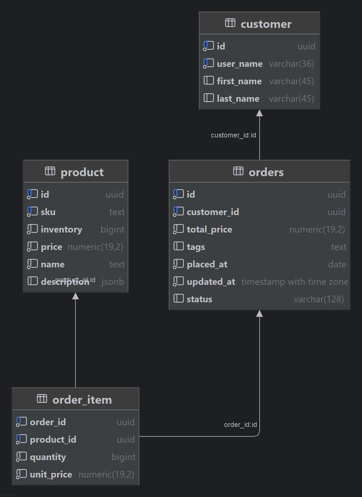

# Order System Demo

A simple order system implemented with CockroachDB and 
[Spring Data Relational](https://docs.spring.io/spring-data/relational/reference/jdbc.html) / JDBC.

The purpose of the demo/sandbox is to highlight explicit/implicit transaction semantics, 
connection pool settings and impact of synthetic transaction execution delays. The demo
allows you to configure pool settings and what type of delays you want to observe.

## Entity Model

# Usage

## Prerequisites

- Java 21+ JDK
    - https://openjdk.org/projects/jdk/21/
    - https://www.oracle.com/java/technologies/downloads/#java21
- Git
    - https://git-scm.com/downloads/mac

## Database Setup

See [start a local cluster](https://www.cockroachlabs.com/docs/v24.2/start-a-local-cluster) for setup instructions.

Assuming a local insecure cluster:

    cockroach sql --insecure -e "create database orders"

## Install the JDK

MacOS (using sdkman):

    curl -s "https://get.sdkman.io" | bash
    sdk list java
    sdk install java 21.0 (use TAB to pick edition)  

Ubuntu:

    sudo apt-get install openjdk-21-jdk

## Running

Edit datasource parameters if needed in [application-default.yml](config/application-default.yml).

Then start the application with:

    ./run.sh

# Terms of Use

This tool is not supported by Cockroach Labs. Use of this tool is entirely at your
own risk and Cockroach Labs makes no guarantees or warranties about its operation.

See [MIT](LICENSE.txt) for terms and conditions.
